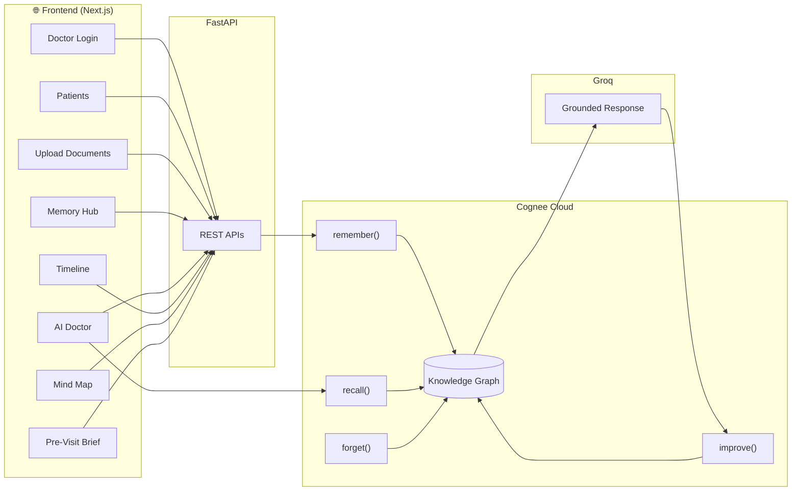

# MediMem AI

> **Great Care Begins Where Memory Never Ends.**

A persistent AI memory assistant for doctors, powered by **Cognee Cloud's Knowledge Graph**.

## The Problem

Doctors see dozens of patients every day. Important context—past medications, allergies, lab results, and diagnoses—often becomes fragmented across documents and visits.

Traditional AI retrieves matching text but doesn't truly remember relationships between facts.

## The Solution

MediMem AI gives every doctor a persistent AI memory for every patient using Cognee Cloud's Knowledge Graph.

## Architecture

## Cognee APIs

| API | Purpose |
|------|---------|
| remember() | Build patient knowledge graph |
| recall() | Retrieve connected information |
| improve() | Strengthen memory over time |
| forget() | Permanently remove patient memory |

## Features

- **AI Doctor** - ask clinical questions in plain language, grounded in real history
- **Upload Documents** - prescriptions & lab reports become connected memory
- **Memory Hub** - documents, nodes, relationships, and alerts in one view
- **Timeline** - a patient's full history in chronological order
- **Mind Map** - an interactive knowledge graph, verifiable on Cognee Cloud
- **Pre-Visit Brief** - a one-click five-point clinical summary
- **Alerts** - automatic drug-conflict and allergy flags
## Tech Stack

| Layer | Technology |
|-------|-----------|
| **Frontend** | Next.js 14 · TypeScript · Tailwind CSS |
| **Backend** | FastAPI · Python |
| **Memory** | Cognee Cloud (V2 API) |
| **LLM** | Groq _(also supports OpenAI, Anthropic, Mistral, Together, Custom)_ |
| **Deployment** | Vercel (frontend) · Railway (backend) |

## Quick links

<a href="https://medimem.vercel.app"><strong>Live App</strong></a> •
<a href="https://medium.com/@bavyasakthivel21/medimem-ai-great-care-begins-where-memory-never-ends-78dfa7ef34c7"><strong>Medium Blog</strong></a> •
<a href="https://youtu.be/LYQI9mxYHYM"><strong>Demo Video</strong></a>

## Built For

WeMakeDevs Hackathon - Cognee Cloud Track
